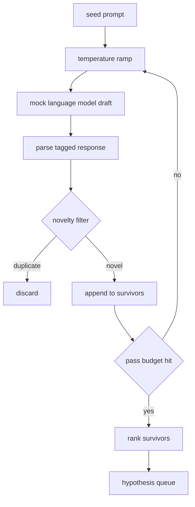

# Hypothesis Generator

> A research agent that asks the same question twice is wasting tokens. The trick is forcing each draft to land somewhere new.

**Type:** Build
**Languages:** Python
**Prerequisites:** Phase 19 Track A lessons 20-29
**Time:** ~90 minutes

## Learning Objectives
- Drive a sampler from a seed prompt and turn its outputs into typed hypothesis records.
- Ramp the sampler temperature on each pass so the next draft drifts further from the last.
- Filter near duplicates with a small embedding model and a cosine distance threshold.
- Rank the survivors with a scoring function that blends novelty, specificity, and testability.
- Hold every step deterministic so the same seed always produces the same queue.

## Why generate, then filter

A planner that asks one model one time gets one hypothesis. That is fine for a worked example. For a research loop it is the wrong shape. The loop wants a ranked queue with depth, so when the first hypothesis fails the runner has the next one ready without paying for another full sampling pass.

Two ideas combine to produce that queue. The first is temperature ramping: each pass through the sampler raises the temperature a notch, so later drafts are encouraged to wander. The second is novelty filtering: after each draft, the generator measures the embedding distance from every prior survivor and rejects anything inside the cluster.

The lesson ships a mock language model that returns scripted token sequences for fixed prompts. The mock is enough to exercise the full path: seed prompt in, temperature ramp applied, candidates parsed, novelty filter run, ranked queue out.

## The Hypothesis shape

```text
Hypothesis
  id             : int           (monotonic within a run)
  text           : str           (the claim)
  variables      : list[str]     (what changes between conditions)
  metric         : str           (what the runner will measure)
  baseline_ref   : str | None    (which paper or run the comparison cites)
  draft_pass     : int           (which sampler pass produced this)
  temperature    : float         (the sampler setting at draft time)
  novelty_score  : float         (distance from prior survivors, 0..1)
  rank_score     : float         (weighted sum used for ordering)
```

`variables` and `metric` are not free text. The parser pulls them from a tagged response. The runner in lesson fifty-two reads these fields directly when it builds the experiment config.

`baseline_ref` is optional but recommended. The evaluator in lesson fifty-three needs a baseline to compare against. If the hypothesis omits one, the evaluator falls back to the previous run on the same metric.

## Architecture



The loop is straight forward. The interesting part is each box has a hard contract.

## Temperature ramp

Start at `t_min`, end at `t_max`, step `(t_max - t_min) / passes`. Each pass calls the sampler at the current temperature. The mock model honors temperature by switching between a small set of scripted responses keyed on `(prompt, temp_bucket)`. The buckets are open intervals so a small change in temperature picks a different bucket and produces a different draft. In production the sampler would be a real model with `temperature=t` passed through.

The default schedule is six passes from `0.2` to `1.2`. Six is enough to fill the queue without paying for samples that the novelty filter will reject anyway. Below `0.2` the model parrots the seed back. Above `1.2` the responses tend to drift off topic and fail the parser.

## Novelty filter

After each draft is parsed, the generator embeds the text and compares against every accepted hypothesis. The embedding is a small hashed bag of word tokens, normalised to unit length. Cosine distance between two unit vectors is `1 - dot(a, b)`. A draft passes if its minimum distance to any prior survivor is above `novelty_threshold`. Default is `0.25`.

The hashed embedding is not fancy. It is deterministic, has zero dependencies, and is enough to catch the obvious case: two drafts that share most of their nouns. A production deployment would swap in a small sentence model. The interface stays the same.

## Rank score

```text
rank_score = w_novelty * novelty_score
           + w_specificity * specificity_score
           + w_testability * testability_score
```

Three sub scores. `novelty_score` is the minimum embedding distance from prior survivors. `specificity_score` is the count of concrete variables in the hypothesis divided by a target count. `testability_score` is one if the hypothesis specifies both a metric and a baseline, half if it only has a metric, zero otherwise.

Default weights are `0.4`, `0.3`, `0.3`. The weights live in the generator config so a downstream lesson can shift them without forking the code.

## Mock language model

```python
class MockLLM:
    def sample(self, prompt: str, temperature: float, seed: int) -> str:
        ...
```

The sampler is deterministic given a `(prompt, temperature, seed)` triple. The mock keeps a scripted response table keyed on `(prompt_signature, temperature_bucket)`. If the table has no entry for a key, the sampler returns a fallback that fails the parser. The fallback path is exercised by one of the tests.

The seed is mixed into the response so the same `(prompt, temperature)` pair with different seeds produces different drafts. In tests we pin the seed to keep results reproducible. In a real deployment the seed would come from a system clock or a counter.

## Output queue

The output is a list of `Hypothesis` records sorted by `rank_score` descending. The runner in lesson fifty-two pops the head, runs the experiment, and the evaluator in lesson fifty-three writes a verdict back. If the verdict says the hypothesis was wrong, the runner pops the next one.

The queue is finite. When it is empty the orchestrator can either widen the seed prompt and run the generator again or stop and report the budget exhausted.

## How to read the code

`code/main.py` defines `Hypothesis`, `MockLLM`, `HypothesisGenerator`, and a deterministic demo. The generator exposes a single `run(seed_prompt, n_passes)` method that returns a sorted queue. The embedding is a hashed bag of tokens. The novelty filter is a single function. The rank score is a single function. Nothing depends on `numpy`; the embedding math is pure stdlib so the lesson stays portable.

`code/tests/test_generator.py` covers the linear path, the duplicate rejection path, the parser failure path, the temperature ramp boundaries, and the rank ordering.

## Where this slots in

Lesson fifty produces the queue. Lesson fifty-one takes the head of the queue and runs a literature search to confirm or refute it. Lesson fifty-two takes the same head and runs an actual experiment. Lesson fifty-three reads both outputs and writes a verdict. The four lessons compose into a research loop with no human in it; a human can step in at any boundary.
