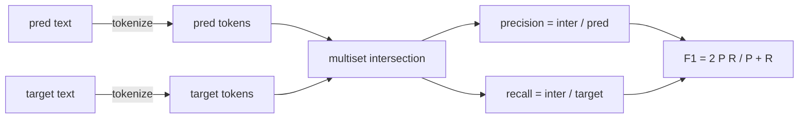
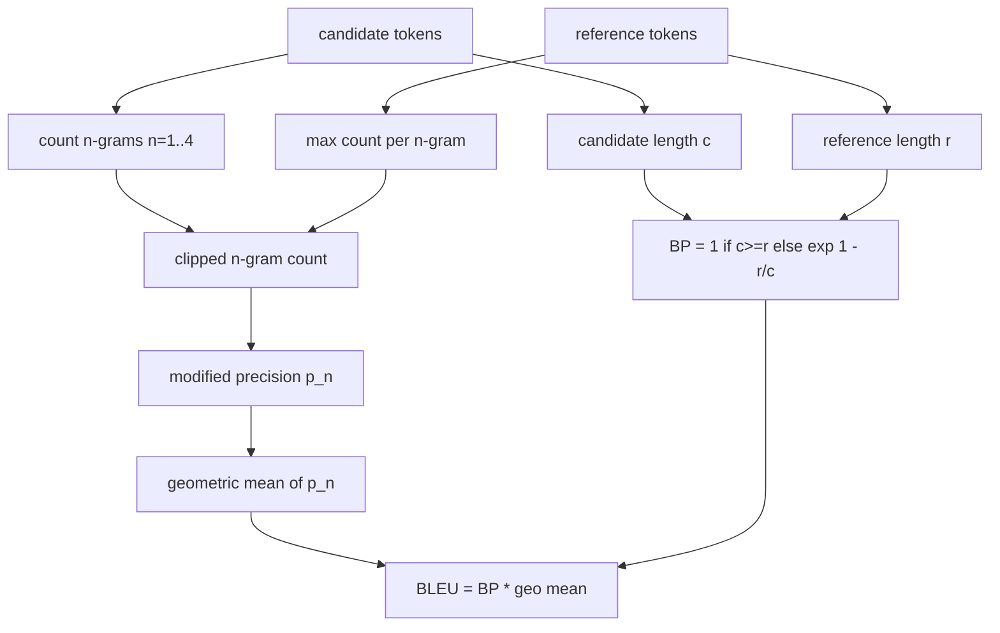

# Classical Metrics

> BLEU, ROUGE-L, F1, exact-match, accuracy. Five metrics that still account for most published LLM eval numbers. Implement each from first principles so you know what the number means.

**Type:** Build
**Languages:** Python
**Prerequisites:** Phase 19 Track B foundations, lesson 70
**Time:** ~90 min

## Learning objectives

- Implement token-level exact-match, F1, and accuracy with explicit tokenisation rules.
- Implement BLEU-4 from the ground up: modified n-gram precision, geometric mean over n equals 1 through 4, brevity penalty.
- Implement ROUGE-L using longest common subsequence, with F-beta combination of precision and recall.
- Dispatch on the metric_name field from lesson 70 so the runner stays metric-agnostic.
- Pin the behaviour with reference vectors drawn from worked examples, not from a third-party library.

## Why reimplement

You will read papers that report BLEU 28.3 and another that reports BLEU 0.283. You will find ROUGE-L scores that differ by ten points across two libraries because one truncates to lowercase and the other does not. The fastest way to stop being confused is to write the metrics yourself, then point at the line where the tokenizer is decided and the line where the smoothing is applied. After that, comparing numbers across papers becomes a matter of reading the metric setup, not arguing about libraries.

Stdlib plus numpy is enough. BLEU is counting and a clamp. ROUGE-L is dynamic programming. F1 is a set intersection on tokens. The hardest part is choosing a tokenizer and committing to it.

## Tokenisation

The tokenizer is `re.findall(r"\w+", text.lower())`. Lowercase, alphanumeric runs, drop punctuation. Every metric in this lesson uses this exact tokenizer. The runner does not get to choose. If you swap tokenizers, you are running a different benchmark.

```python
TOKEN_RE = re.compile(r"\w+", re.UNICODE)
def tokenize(text):
    return TOKEN_RE.findall(text.lower())
```

This is a deliberate simplification. Production setups will care about CJK, contractions, and code identifiers. The point of the lesson is that the tokenizer is a contract, not a knob.

## Exact match

```python
def exact_match(pred, targets):
    return float(any(pred.strip() == t.strip() for t in targets))
```

It returns 1.0 or 0.0 per task. The aggregate over a dataset is the mean. This is the workhorse for arithmetic, MCQ, and short classification tasks.

## Token-level F1

Set up the token multiset for prediction and target. Precision is the multiset intersection divided by the multiset of the prediction. Recall is the same intersection divided by the multiset of the target. F1 is the harmonic mean. The implementation handles the empty-prediction and empty-target edge cases.



For multi-target tasks, we take the best F1 over the target list. That matches the SQuAD-style behaviour widely reported in the literature.

## BLEU-4

BLEU is the canonical machine-translation metric and it still shows up in summarisation work. The formulation we use is corpus-level BLEU-4 with the standard brevity penalty and additive-one smoothing on modified n-gram counts so a single missing 4-gram does not push the score to zero.

For each candidate-reference pair, we count modified n-gram precision for n equals 1, 2, 3, 4. Modified precision clips the candidate n-gram count by the maximum count of that n-gram in any reference, so a candidate cannot inflate by repeating one phrase. The geometric mean across the four precisions is wrapped by the brevity penalty.



The smoothing rule is the one Lin and Och called method 1: add one to both numerator and denominator of every n-gram precision before taking the log. This avoids `log 0` when a reference has no matching 4-gram and stays close to the unsmoothed value on long candidates.

## ROUGE-L

ROUGE-L compares the longest common subsequence of the candidate and reference token sequences. The LCS captures word order without forcing contiguity, which is why it is the default summarisation metric. We compute the LCS length with a standard dynamic-programming table, then derive recall as `lcs / reference length`, precision as `lcs / candidate length`, and combine with F-beta where beta equals one for the symmetric F1 form.

```python
def lcs_length(a, b):
    n, m = len(a), len(b)
    dp = numpy.zeros((n + 1, m + 1), dtype=int)
    for i in range(n):
        for j in range(m):
            if a[i] == b[j]:
                dp[i+1, j+1] = dp[i, j] + 1
            else:
                dp[i+1, j+1] = max(dp[i+1, j], dp[i, j+1])
    return int(dp[n, m])
```

The numpy table makes the implementation legible; pure Python lists would work too. Tasks that opt into ROUGE-L pay the O(n m) cost per task. For typical summary lengths that stays under a millisecond.

## Accuracy

For multi-target classification tasks, accuracy reduces to exact-match against a single normalised target. We expose it as a separate function so the dispatcher can dispatch on `metric_name` without going through string comparisons inside the runner.

## Dispatch contract

The single entry point is `score(metric_name, prediction, targets)`. It returns a float in `[0, 1]`. The runner does not branch on metric name. It hands the call off and writes the result. This is the surface that lesson 75 will glue to the task spec from lesson 70.

```python
def score(metric_name, pred, targets):
    if metric_name == "exact_match":
        return exact_match(pred, targets)
    if metric_name == "f1":
        return max(f1_score(pred, t) for t in targets)
    if metric_name == "bleu_4":
        return max(bleu4(pred, t) for t in targets)
    if metric_name == "rouge_l":
        return max(rouge_l(pred, t) for t in targets)
    if metric_name == "accuracy":
        return accuracy(pred, targets)
    raise ValueError(f"unknown metric_name: {metric_name}")
```

`code_exec` is handled in lesson 72 and slotted into the dispatcher there.

## What this lesson does not do

It does not call a model. It does not normalise generations beyond what the post-process rules from lesson 70 already did. It does not compute confidence intervals. It does not do BLEURT or BERTScore (those need a model and live in a different lesson). The point is the floor: five metrics, one tokenizer, one dispatch table.

## How to read the code

`main.py` defines each metric as a free function plus the dispatcher. The reference vectors live in the `_reference_examples` block at the bottom of the file. The demo runs the dispatcher against eight examples and prints per-metric scores. The tests in `code/tests/test_metrics.py` pin the reference vectors and stress every edge case (empty prediction, empty reference, no shared tokens, exact match, repeated phrase clipping).

Read `main.py` top to bottom. The functions are ordered by complexity. exact_match and accuracy are one line each. F1 is six lines. BLEU and ROUGE-L are the heavy parts and they include detailed comments on the smoothing rule and the LCS recurrence.

## Going further

The classical metrics are necessary, not sufficient. They reward surface overlap and miss meaning. The fix is to layer model-based metrics on top (BLEURT, BERTScore, GEval) once you trust the classical floor. That is a later lesson. For now: make these five work, pin them with tests, and you have a metric stack that is auditable, fast, and reproducible.
