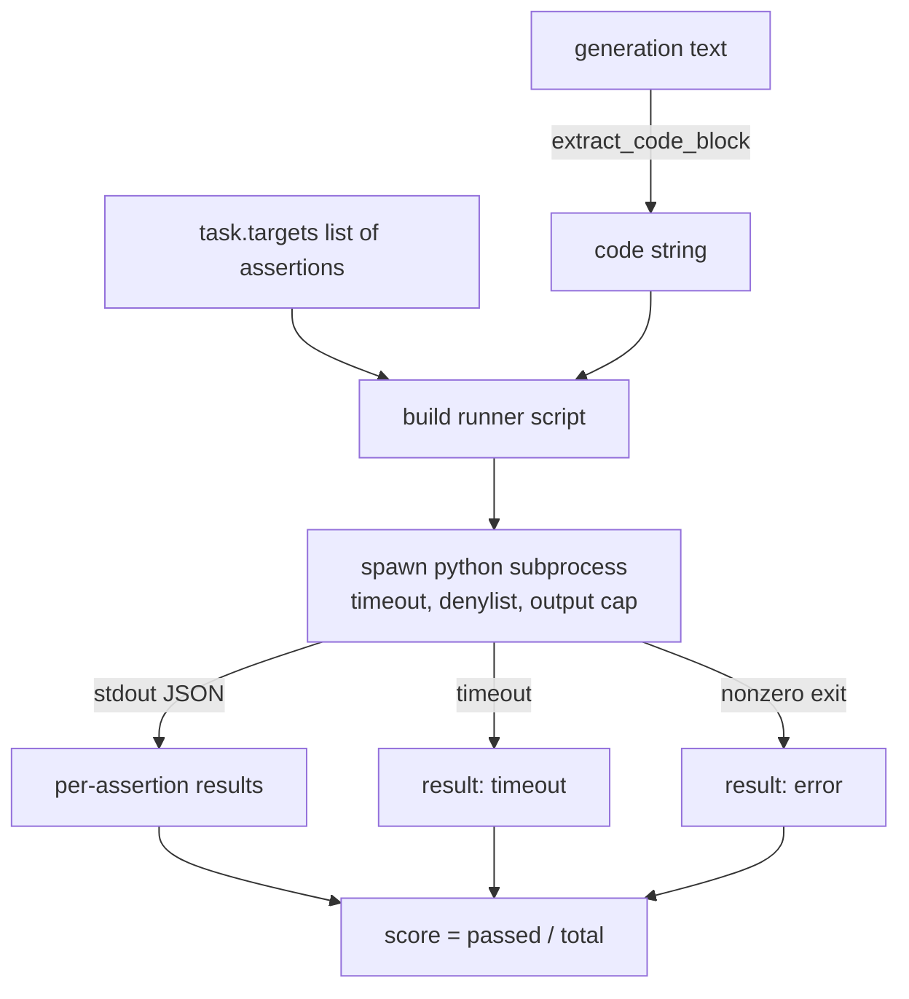
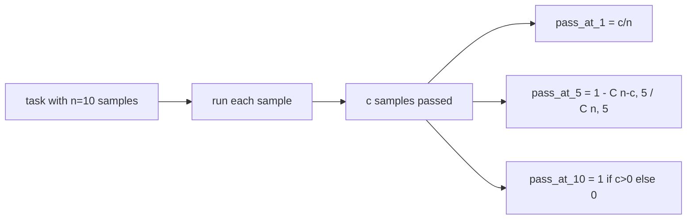

# Code Exec Metric

> Generated code is right when it passes the tests. The eval harness has to extract code, run it without crashing the host, and tally pass-rates honestly. This lesson builds that surface.

**Type:** Build
**Languages:** Python
**Prerequisites:** Phase 19 Track B foundations, lessons 70 and 71
**Time:** ~90 min

## Learning objectives

- Extract a code block from a free-form generation in a way that matches the post-process rule from lesson 70.
- Execute candidate code in an isolated subprocess with a wall-clock timeout, output cap, and an import denylist.
- Score a task as the fraction of supplied assertion strings that pass against the candidate.
- Compute pass-at-k for tasks that sample multiple generations from one model.
- Treat sandbox crashes, syntax errors, and timeouts as first-class fail modes with distinct exit codes the runner can log.

## Why an isolated subprocess

Inline `exec` is a security and stability hazard. A generated `while True: pass` blocks the eval forever. A generated `import shutil; shutil.rmtree('/')` is exactly as catastrophic as it sounds. The fix is to spawn a fresh Python interpreter per candidate, pass the code on stdin, write the assertion results to stdout, and kill the process if it overruns. The host eval process keeps running.

Real evals like HumanEval, MBPP, BigCodeBench, and LiveCodeBench all use a subprocess sandbox. Some layer Docker on top. We stop at the subprocess for a reason: it is portable, it is stdlib, and it catches the failure modes that matter for educational eval. Production deployments add seccomp, network isolation, and a read-only filesystem. The next lesson on hardening lives outside this track.

## The shape of a code-exec task

A `code_exec` task carries assertion strings in `targets`. The runner extracts a fenced code block from the generation, builds a test harness around it, and runs the result.



The score is a fraction in `[0, 1]`. A task with three assertions where two pass scores 0.667. The runner returns the same shape no matter what fails: the subprocess crashes are mapped to a normalised error code, not a Python traceback bubbling up to the harness.

## The denylist

The denylist is import-based. Before running candidate code, the runner script rewrites imports of dangerous modules to a stub that raises `ImportError("denied")`. The list is deliberately conservative: `os.system`, `subprocess`, `socket`, `requests`, `urllib`, `urllib.request`, `urllib.error`, `urllib.parse`, `ctypes`, `shutil`, `http.client`, `asyncio.subprocess`.

We do not pretend this is bulletproof. Determined adversarial code can escape any in-process sandbox in Python. The denylist is a backstop. The wall-clock timeout and the output cap are the load-bearing controls.

```python
DENIED = {
    "os.system": True,
    "subprocess": True,
    "socket": True,
    "shutil": True,
    "requests": True,
    "urllib": True,
    "ctypes": True,
}
```

We wrap the candidate by prepending `import sys` and a guard that monkey-patches `os.system` to raise. The full template is in `main.py`.

## Wall-clock timeout

Every subprocess gets a default budget of three wall-clock seconds. The runner uses `subprocess.run(..., timeout=t)`. If the timeout fires, the runner catches `TimeoutExpired`, kills the process, and records a `timeout` exit reason for the task. The score for that task is zero. The runner moves on.

The timeout is configurable per task through `task.metadata.timeout_s`. Long-running unit tests can ask for more; the validator from lesson 70 caps the value at thirty seconds to keep the suite bounded.

## Output cap

The subprocess can flood stdout, exhausting host memory. The runner streams stdout into a buffer and kills the child as soon as the running total crosses 256 KB. The result is recorded as `exit_code = error` with the detail string `"output overflow"`. This shows up in practice when a generation accidentally writes an infinite loop that prints.

## Pass-at-k

Pass-at-k is the unbiased estimator used by HumanEval and friends. Given `n` independent samples per task and `c` of them passing, the probability that a sample of size `k` from the `n` contains at least one passing solution is:

```
pass_at_k(n, c, k) = 1 - C(n - c, k) / C(n, k)
```

When `n - c < k` the numerator is undefined and the value is `1`. The implementation handles the edge case directly. We expose `pass_at_k(n, c, k)` for use by the leaderboard layer in lesson 74.



## Exit codes

The runner returns one of five outcomes per task:

- `pass` when every assertion passed.
- `assertion_fail` when the code ran but at least one assertion failed.
- `syntax_error` when the code did not import or had a SyntaxError.
- `timeout` when the wall clock expired.
- `error` for any other crash, including denylist hits and output overflow (overflow surfaces with detail `"output overflow"`).

The score is still a fraction. The exit code is metadata. Downstream lessons can decide whether to count a timeout as zero or as missing data.

## What this lesson does not do

It does not give you a real sandbox. It does not run untrusted code from the open web. It does not handle stateful tasks like file I/O or network calls. Those need a container or a microVM. The point of this lesson is the contract: an isolated subprocess, a denylist, a timeout, an output cap, a clean exit-code vocabulary, and pass-at-k math.

## How to read the code

`main.py` defines `extract_code`, `run_candidate`, `score_code_exec`, and `pass_at_k`. The subprocess runner script is built as a string and passed as `-c` to a fresh Python interpreter. The tests in `code/tests/test_exec.py` exercise the four exit codes plus pass-at-k against worked examples drawn from the HumanEval style.

Read `main.py` top to bottom. The runner template is the load-bearing piece. Stare at the assertion loop until you can predict the JSON envelope it writes back to the parent process.

## Going further

Once the subprocess shape works, the next concern is portability. Different Python versions handle SIGKILL differently on Windows. The cleanest fix is to put the runner in a Docker image. The next thing after that is replacing assertion strings with real unit test files so the eval matches what production CI does. Stop calling assertion strings tests at that point; they are toy tests and they have toy failure modes.
