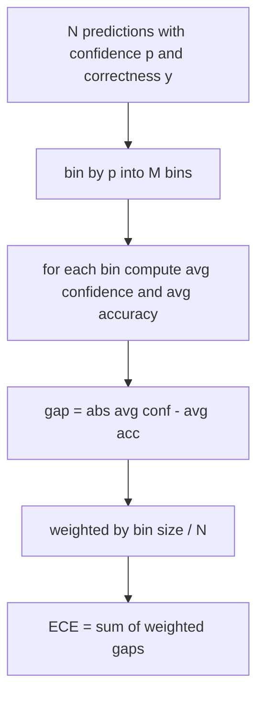
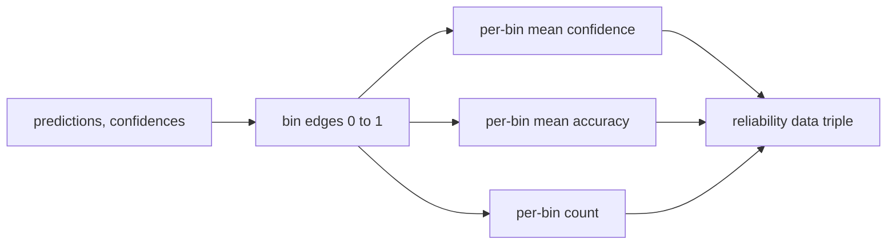

# Perplexity and Calibration

> If your model says 90 percent confident on a thousand answers and gets six hundred right, it is not well calibrated. Calibration is half of trustworthy eval. The other half is perplexity, which tells you whether the model thinks the held-out text is plausible at all.

**Type:** Build
**Languages:** Python
**Prerequisites:** Phase 19 Track B foundations, lessons 70 and 71
**Time:** ~90 min

## Learning objectives

- Compute token-level perplexity on a held-out corpus from token negative log-probabilities supplied by the model adapter.
- Compute the expected calibration error (ECE) of a classifier or multiple-choice eval from binned predicted probabilities.
- Compute the Brier score (mean squared error against the indicator of correctness) and explain when it does what ECE does not.
- Build the reliability diagram data needed to plot a confidence-versus-accuracy curve.
- Wire all three into the eval harness so the runner can attach `perplexity`, `ece`, and `brier` numbers to a model report.

## What perplexity tells you

Perplexity is the exponentiated average negative log-likelihood per token. Lower is better. A perplexity of one means the model assigns probability one to every actual token. A perplexity of the vocabulary size means the model is uniform and learnt nothing. Real numbers fall in between: a strong 2026 base model on WikiText-103 sits around eight to twelve. A bad one on the same text sits at fifty plus.

The harness does not compute log-probabilities itself. Those come from the model adapter. The harness aggregates: it takes a list of per-token log-probabilities, a list of token counts per sequence, and returns corpus perplexity.

```python
def perplexity(neg_log_probs, token_counts):
    total_nll = sum(neg_log_probs)
    total_tokens = sum(token_counts)
    return math.exp(total_nll / total_tokens)
```

The implementation handles zero-token edge cases and asserts that the negative log-probabilities are non-negative. A common mistake is to forget the negation: an adapter that returns `log p` instead of `-log p` produces a perplexity below one, which is impossible. The function catches that as a contract violation.

## What ECE measures

Expected calibration error groups predictions by their confidence into a fixed number of bins, then measures the average gap between confidence and accuracy across bins, weighted by bin size.



The standard formulation uses ten equal-width bins on `[0, 1]`. The implementation supports any positive integer count. We expose a `bins` parameter so the runner can choose between the publishing convention (10) and the comparison convention (15).

ECE is biased by bin count and sample size. With ten bins and a hundred predictions, you cannot distinguish 0.02 ECE from random noise. The implementation returns the number of populated bins along with the ECE so the runner can refuse to report a single number on too few samples.

## What Brier score does that ECE does not

ECE only cares about average gaps. A model that is overconfident on half the bins and underconfident on the other half can have low ECE while being poorly calibrated locally. The Brier score measures squared error against the true outcome per prediction, so it penalises spread directly.

For binary outcomes, Brier is `mean((p_i - y_i)^2)`. It decomposes into reliability, resolution, and uncertainty. We compute the score and the decomposition. The runner reports the scalar but logs the decomposition for the dashboard.

```python
def brier(p, y):
    return float(np.mean((p - y) ** 2))
```

## Reliability diagram data

A reliability diagram plots predicted confidence against empirical accuracy in each bin. The diagonal is perfect calibration. The function returns three arrays: per-bin average confidence, per-bin average accuracy, and per-bin count. The plotting code lives downstream; this lesson stops at the data shape.



The returned tuple is what a calling layer needs to draw the plot or compute a custom ECE variant (adaptive ECE, sweep ECE, etc.). We return numpy arrays so downstream code does not have to convert.

## Confidence sources

The harness does not assume confidence comes from softmax. It accepts any number in `[0, 1]` per prediction. For multiple-choice tasks the natural confidence is `softmax over option log-likelihoods`. For free-text the natural confidence is the model's self-reported probability or the exponential of the average log-likelihood. The eval just consumes the number. Where it comes from is the adapter's job.

## Edge cases

- All predictions wrong: ECE is the average confidence, Brier is high, perplexity is whatever the model thinks of the text.
- All predictions correct with high confidence: ECE near zero, Brier near zero.
- Perfectly uncertain predictor at p=0.5: ECE is 0.5 minus accuracy, Brier is 0.25 minus a correction term.
- Empty input: ECE, Brier, and reliability return `0.0` (or zero-filled arrays). Perplexity returns `NaN` for the zero-token case. None of these paths emit a warning; the runner inspects the values and decides whether to report or skip.

These cases are baked into the tests. A real model on a real benchmark will not hit them, but a buggy adapter or a tiny sample will, and the runner should not crash.

## Dispatch

Calibration is not a per-task metric like F1. It is a per-model report. The runner accumulates `(confidence, correct)` pairs across the entire eval and computes ECE, Brier, and reliability data once. Perplexity is computed over a held-out text corpus, separate from the task-by-task scoring.

The interface is:

```python
report = CalibrationReport.from_predictions(confidences, correct)
report.ece          # float
report.brier        # float
report.reliability  # tuple of three numpy arrays
report.populated_bins  # int
```

`PerplexityResult.from_token_nll(neg_log_probs, token_counts)` returns the perplexity and the average negative log-likelihood per token.

## What this lesson does not do

It does not call a model. It does not implement softmax. It does not estimate confidence from output tokens; that is the adapter's job. It does not do temperature scaling or Platt scaling; those are post-hoc fixes that live in a different lesson. The point of this lesson is to make the three numbers (perplexity, ECE, Brier) trustworthy and reproducible.

## How to read the code

`main.py` defines `perplexity`, `expected_calibration_error`, `brier_score`, `reliability_diagram`, and the `CalibrationReport` / `PerplexityResult` dataclasses. The demo runs on synthetic predictions where the ground truth is known: a well-calibrated model, an overconfident one, and an underconfident one. The tests in `code/tests/test_calibration.py` pin every edge case plus reference values for the synthetic predictors.

Read `main.py` top to bottom. The function ordering goes scalar to vector to report. Each function has a short docstring with the math and the contract.

## Going further

Calibration is the most ignored axis in published eval. Most leaderboards report a single accuracy number and call it done. A model that wins on accuracy and loses on Brier is a worse production deployment than a model that scores a few points lower on accuracy but reliably reports its uncertainty. Once you have the calibration plumbing in place, add temperature scaling on a held-out validation slice, recompute ECE, and watch the gap shrink. That is a separate lesson, but the floor lives here.
