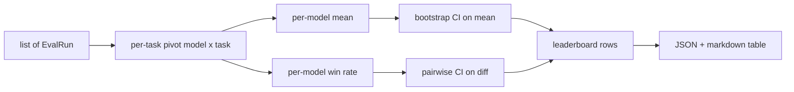
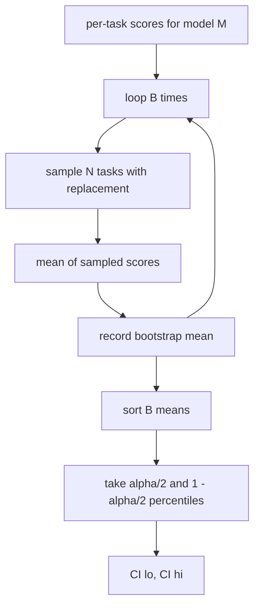

# Leaderboard Aggregation

> Per-task scores are easy. Per-model rankings across heterogeneous tasks are harder. Statistical significance on a thousand-prediction leaderboard is the part everyone skips. This lesson does not skip it.

**Type:** Build
**Languages:** Python
**Prerequisites:** Phase 19 Track B foundations, lessons 70, 71, 73
**Time:** ~90 min

## Learning objectives

- Aggregate per-task scores across multiple models and multiple tasks into a tidy per-model row.
- Normalise heterogeneous scores so that pass rates and BLEU values do not over-influence the aggregate.
- Rank models by mean and by win-rate, and explain when each is the right summary.
- Compute bootstrap confidence intervals on the mean score per model and on pairwise differences.
- Output the leaderboard as a JSON report and as a markdown table the runner in lesson 75 can paste into a CI comment.

## The shape of input

The aggregator consumes a list of `EvalRun` records:

```python
@dataclass
class EvalRun:
    model_id: str
    task_id: str
    metric_name: str
    score: float          # in [0, 1]
    category: str
```

The runner in lesson 75 emits one record per `(model, task)` pair. The aggregator does not care how the score was produced. It expects normalisation to already have happened: every score is in `[0, 1]`.

## The output

Three tables come out:



The leaderboard row contains: `model_id`, `mean_score`, `mean_ci_lo`, `mean_ci_hi`, `win_rate`, `tasks_completed`, and an optional `categories` map for per-category mean.

## Normalisation

If one task scores in `[0, 1]` and another in `[0, 100]`, the second silently dominates the mean. The aggregator validates that every input score sits in `[0, 1]` and refuses the run otherwise. The fix lives upstream: the metric should already return a fraction. Lessons 71 to 73 enforce that contract.

## Mean and win-rate

The two ranking schemes serve different goals.

Mean score is the average of per-task scores for one model. It is the headline number leaderboards report. It is sensitive to outliers and to task imbalance.

Win-rate counts how often a model beats every other model on the same task. For each task, the model with the highest score wins (ties split). Win rate equals wins divided by the number of tasks where the model has a score. It is less sensitive to outliers and to scale differences but loses information.

```python
def win_rate(model_id, runs_by_task, all_models):
    wins, total = 0, 0
    for task_id, runs in runs_by_task.items():
        scores = {r.model_id: r.score for r in runs if r.model_id in all_models}
        if model_id not in scores:
            continue
        total += 1
        best = max(scores.values())
        if scores[model_id] >= best:
            wins += 1
    return wins / total if total else 0.0
```

The harness reports both. The runner in lesson 75 ranks by mean by default; the markdown column for win-rate is right there in case the user prefers it.

## Bootstrap confidence intervals

Per-model means come with a confidence interval estimated by bootstrap resampling over tasks. We resample task ids with replacement, compute the mean over the resampled set, repeat `B` times, and take the percentile interval at level `alpha`.



For pairwise comparisons we bootstrap the per-task difference `score_A - score_B`, take the percentile interval, and report it. The user reads off whether the interval excludes zero. If it does, the difference is significant at level alpha. If it does not, the leaderboard treats the models as tied.

The low-level helpers (`bootstrap_mean_ci`, `bootstrap_pairwise_diff`) default to `B=1000`; the public aggregators (`aggregate`, `pairwise_diffs`) default to `b=500` so the demo and tests stay quick. The default alpha is 0.05. The lesson keeps the bootstrap pure numpy, no scipy.

## Categories

If `EvalRun.category` is set, the aggregator also reports per-category mean. This is the column on every leaderboard that says `math`, `reasoning`, `code`, `safety`. It lets the runner spot whether a model is good overall but weak in code, which is information the headline mean hides.

## Markdown rendering

The leaderboard is rendered as a markdown table:

```text
| Rank | Model | Mean | 95% CI | Win rate | Tasks |
|------|-------|------|--------|----------|-------|
| 1    | gpt   | 0.78 | 0.74-0.82 | 0.62 | 50 |
| 2    | claude| 0.75 | 0.71-0.79 | 0.34 | 50 |
| 3    | random| 0.10 | 0.07-0.13 | 0.04 | 50 |
```

The table is sorted by mean score. The CI is rendered to two decimals. Long model ids are truncated to twenty characters.

## What this lesson does not do

It does not run models. It does not call the metric layer. It does not implement adaptive ECE or other calibration variants; those are lesson 73. It does not implement task weighting. Every task counts the same here. Production leaderboards weight tasks; we leave that hook open through the `weight` field but ignore it in the aggregator. Add weighting in a follow-up lesson if you need it.

## How to read the code

`main.py` defines `EvalRun`, `LeaderboardRow`, `aggregate`, `bootstrap_mean_ci`, `bootstrap_pairwise_diff`, and `render_markdown`. The demo builds a synthetic suite of three models and twelve tasks, aggregates, and prints the leaderboard plus the pairwise diff table. The tests in `code/tests/test_leaderboard.py` pin the bootstrap, the markdown rendering, the win-rate edge cases, and the empty-input behaviour.

Read `main.py` top to bottom. The data shape (EvalRun, LeaderboardRow) comes first, the aggregator next, the bootstrap third, the rendering last. Each function has a focused contract.

## Going further

The natural next step is paired-task significance instead of unpaired bootstrap. If model A and B both ran the same hundred tasks, the appropriate test is the paired bootstrap on task-by-task differences, which we implement. Beyond that, you want a hierarchical bootstrap that respects task families (math problems are not independent from each other; an arithmetic error pattern affects ten of them). That is a follow-up. The point of this lesson is to get the floor right so the eval reports a number you can defend.
